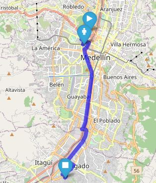
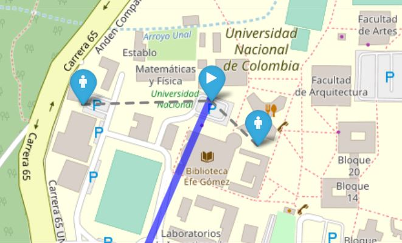

# osrm_draw_route

Repositorio creado con la intención de crear  visualizaciones en mapas interactivos gratuitamente utilizando [OSRM](http://project-osrm.org/) y Python .
Actualmente se obtienen rutas entre dos puntos arbitrarios, pero se desea generalizarlo para exponer múltiples rutas con un número variables de paradas cada una.

|              Ejemplo ruta completa               |                Ejemplo agrupaciones                |
| :----------------------------------------------: | :------------------------------------------------: |
|  |  |

## Notebook mapa interactivo
- [Ejemplo paradas](https://nbviewer.jupyter.org/github/NumberPiOso/osrm_draw_route/blob/main/example_1.ipynb)
- [Ejemplo agrupaciones](https://nbviewer.jupyter.org/github/NumberPiOso/osrm_draw_route/blob/main/example_grouped_users.ipynb)
## Referencias
- https://www.thinkdatascience.com/post/2020-03-03-osrm/osrm/
