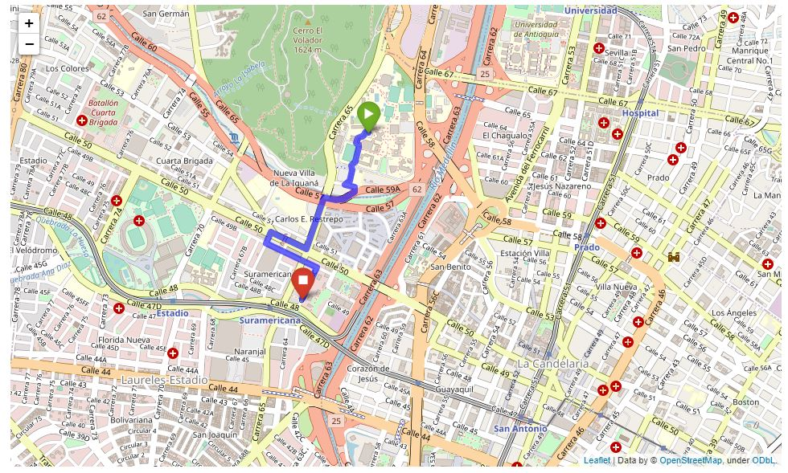

# osrm_draw_route

Repositorio creado con la intención de crear  visualizaciones en mapas interactivos de rutas producidas por [OSRM](http://project-osrm.org/).
Actualmente se obtienen rutas entre dos puntos arbitrarios, pero se desea generalizarlo para exponer múltiples rutas con un número variables de paradas cada una.

## Notebook mapa interactivo
[Sin paradas intermedias](https://nbviewer.jupyter.org/github/NumberPiOso/osrm_draw_route/blob/main/dibujo_mapa.ipynb)

## Referencias
- https://www.thinkdatascience.com/post/2020-03-03-osrm/osrm/